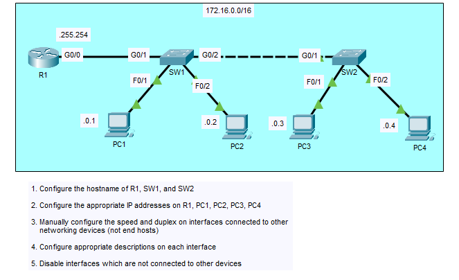
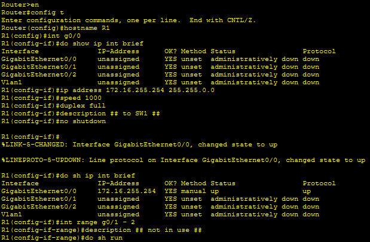
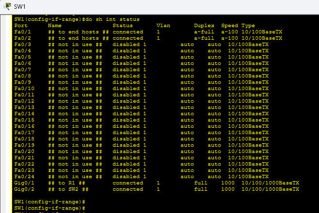
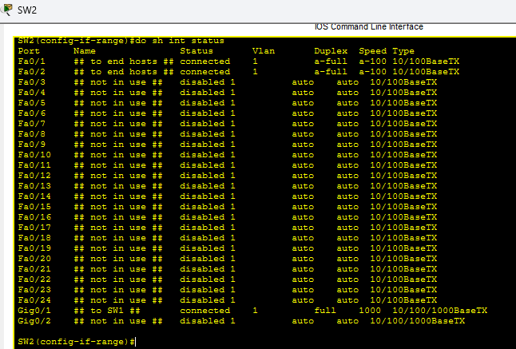

# CCNA Day 9 Lab – Switch and Router Interface Configuration,
# Speed/Duplex, Descriptions, and Unused Port Shutdown

---

## Overview

This lab covers full interface configuration on a router and two switches across a single subnet. Tasks included setting hostnames, configuring IP addresses, manually setting speed and duplex on inter-device links, adding interface descriptions, and disabling all unused ports as a security best practice. All configurations were verified using `show ip interface brief` and `show interfaces status` on both switches.

---

## Environment

| Tool | Purpose |
|------|---------|
| Cisco Packet Tracer | Network simulation and CLI practice |
| Cisco 2911 Router (R1) | Gateway router for 172.16.0.0/16 network |
| Cisco Switches (x2) | SW1, SW2 — LAN switching |
| PCs (x4) | PC1, PC2, PC3, PC4 — end host workstations |
| GitHub | Documentation and version control |

---

## Network Topology

*Single subnet topology — R1 connected to SW1, SW1 connected to SW2,
four PCs distributed across both switches on 172.16.0.0/16*

---

## IP Addressing Scheme

| Device | Interface | IP Address | Subnet Mask | Default Gateway |
|--------|-----------|-----------|-------------|----------------|
| R1 | G0/0 | 172.16.255.254 | 255.255.0.0 | N/A |
| PC1 | — | 172.16.0.1 | 255.255.0.0 | 172.16.255.254 |
| PC2 | — | 172.16.0.2 | 255.255.0.0 | 172.16.255.254 |
| PC3 | — | 172.16.0.3 | 255.255.0.0 | 172.16.255.254 |
| PC4 | — | 172.16.0.4 | 255.255.0.0 | 172.16.255.254 |

---

## Lab Tasks and Results

---

### ✅ Task 1 — Configured Hostnames on R1, SW1, and SW2

Set hostnames on all three devices in global configuration mode.

Router(config)#hostname R1

Switch(config)#hostname SW1

Switch(config)#hostname SW2

---

### ✅ Task 2 — Configured IP Address on R1 G0/0

Assigned the gateway IP address to R1's GigabitEthernet0/0 interface and confirmed it came up successfully.

R1(config)#int g0/0

R1(config-if)#ip address 172.16.255.254 255.255.0.0

R1(config-if)#no shutdown

Confirmed with `do show ip interface brief` — G0/0 showing 172.16.255.254, status up, protocol up.

---

### ✅ Task 3 — Manually Configured Speed and Duplex on Inter-Device Links

Manually set speed to 1000 and duplex to full on all interfaces connecting networking devices — R1 G0/0, SW1 G0/1 (to R1), SW1 G0/2 (to SW2), and SW2 G0/1 (to SW1). Speed and duplex are only manually configured on links between network devices — end host connections are left on auto.

R1(config-if)#speed 1000

R1(config-if)#duplex full

*R1 CLI — hostname set, G0/0 configured with IP, speed 1000, duplex full,
description added, no shutdown confirmed up*

---

### ✅ Task 4 — Configured Interface Descriptions on All Devices

Added descriptive labels to all active interfaces on R1, SW1, and SW2 to document connections.

**R1:**

R1(config-if)#description ## to SW1 ##

**SW1 descriptions:**
- G0/1: ## to R1 ##
- G0/2: ## to SW2 ##
- Fa0/1: ## to end hosts ##
- Fa0/2: ## to end hosts ##
- Unused ports: ## not in use ##

**SW2 descriptions:**
- G0/1: ## to SW1 ##
- Fa0/1: ## to end hosts ##
- Fa0/2: ## to end hosts ##
- Unused ports: ## not in use ##

---

### ✅ Task 5 — Disabled All Unused Interfaces

Used `interface range` to select all unused ports on both switches and applied `shutdown` to disable them. This is a network security best practice — unused ports should never be left active.

SW1(config)#int range fa0/3 - 24

SW1(config-if-range)#description ## not in use ##

SW1(config-if-range)#shutdown

SW2(config)#int range fa0/3 - 24, g0/2

SW2(config-if-range)#description ## not in use ##

SW2(config-if-range)#shutdown

---

### ✅ Task 6 — Verified SW1 Interface Status

Ran `show interfaces status` on SW1. Active ports (Fa0/1, Fa0/2, Gig0/1, Gig0/2) showed connected status with correct descriptions. All unused ports showed disabled status with ## not in use ## description confirmed.

*SW1 show interfaces status — Fa0/1 and Fa0/2 connected to end hosts,
Gig0/1 to R1 and Gig0/2 to SW2 at 1000 full, all unused ports disabled*

---

### ✅ Task 7 — Verified SW2 Interface Status

Ran `show interfaces status` on SW2. Fa0/1, Fa0/2, and Gig0/1 showed connected with correct descriptions. All unused ports including Gig0/2 showed disabled status confirmed.

*SW2 show interfaces status — Fa0/1 and Fa0/2 connected to end hosts,
Gig0/1 to SW1 at 1000 full, all unused ports including Gig0/2 disabled*

---

## Key Observations

| Observation | Explanation |
|-------------|-------------|
| Speed and duplex on device links only | End host ports left on auto — manual config only on inter-device links |
| Unused ports disabled | Security best practice — prevents unauthorized device connections |
| Descriptions on all interfaces | Professional documentation standard for network management |
| G0/0 up after no shutdown | Router interfaces require explicit no shutdown to become active |
| show interfaces status | Best command for quick overview of all switch port states |

---

## Skills Demonstrated

| Skill | How It Was Applied |
|-------|--------------------|
| Hostname Configuration | Set R1, SW1, SW2 hostnames via global config |
| Router Interface Config | Assigned IP, speed, duplex, description, no shutdown on R1 G0/0 |
| Speed and Duplex | Manually configured 1000/full on all inter-device links |
| Interface Descriptions | Labeled all active and inactive ports on all three devices |
| Unused Port Shutdown | Disabled all inactive switch ports using interface range |
| Show Commands | Used show ip int brief and show interfaces status to verify configs |
| Interface Range | Applied bulk configuration to multiple ports simultaneously |

---

## Lessons Learned

**Manually setting speed and duplex prevents duplex mismatch errors.** When two devices negotiate speed and duplex automatically and one side fails to auto-negotiate correctly, the result is a duplex mismatch — one side runs full duplex, the other runs half duplex. This causes collisions, retransmissions, and degraded performance that can be very difficult to diagnose. Manually setting speed and duplex on links between network devices eliminates this risk entirely.

**Disabling unused ports is a baseline security control.** An active but unconnected switch port is an open door — anyone who plugs a device into that port gets network access. Shutting down unused ports with `shutdown` and labeling them with a description ensures that any unauthorized connection requires deliberate reconfiguration by an administrator. This is a required control in most enterprise security standards.

**Interface descriptions are documentation, not decoration.** In a production network with hundreds of interfaces across dozens of devices, descriptions are what allow an engineer to understand the topology without tracing cables. A description like `## to R1 ##` on a switch uplink tells the next engineer exactly what that port connects to — reducing troubleshooting time and preventing accidental misconfiguration.

---

## 💼 Real-World Application

Interface configuration is performed every time a new device is added to an enterprise network. Network engineers set speed, duplex, and descriptions as part of every switch and router deployment. Security teams audit switch configurations specifically looking for active unused ports as a compliance requirement. Help desk engineers reference interface status and descriptions when troubleshooting connectivity issues. The combination of correct interface configuration and proper documentation is what keeps enterprise networks manageable, secure, and fast to troubleshoot.

---

## References

- [Jeremy's IT Lab — CCNA Day 9](https://www.youtube.com/watch?v=9eH16Fxeb9o)
- [Jeremy's IT Lab — Full CCNA Course](https://www.youtube.com/playlist?list=PLxbwE86jKRgMpuZuLBivzlM8s2Dk5lXBQ)
- [Cisco Packet Tracer Download](https://www.netacad.com/courses/packet-tracer)
